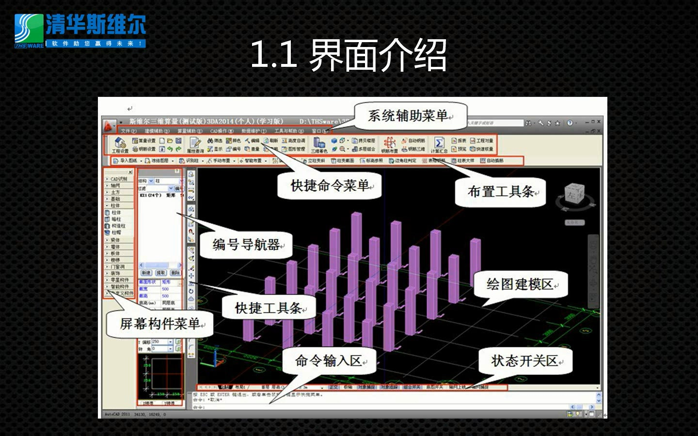

#三维算量基础
***
[TOC]

## 一、软件工作区

## 二、操作步骤
### 鼠标 
* 中键（滚轮）：放大、缩小、平移
* 左键：选择对象（点选、左框选、右框选）
* 右键：确认选择、结束命令

### W命令
在命令输入区 
输入`w`——`空格`——点击`选择对象`——`鼠标框选`——`选择路径、更改名称`——保存

### 新建工程
>内容多参见建筑说明
#### (1).计量模式
①[清单/定额](http://blog.renren.com/share/250797667/6938748896)
②计算精度
#### (2).楼层设置
手动输入/**自动识别**
#### (3).建筑、结构说明
砼材料/抗震等级/保护层/结构类型
#### (4).工程特征
* 工程概况:建筑面积、结构特征
* 计算定义/土方定义
#### (5).钢筋标准
* 03G101 
* 11G101 
* 16G101

### 导入图纸
——分解图纸
### 轴网
#### 识别轴网
`CAD识别`——`识别轴网`——`提取轴网`——`提取轴号`
>右键确认后再进行下一步
#### 新建轴网（手动布置轴网）
`新建轴网`-`轴网类型`-`开间数据`-`进深数据`-`确定,指定插入点`
